# Vision-Based Lane Detection Using Machine Learning

[](https://www.python.org/downloads/release/python-3810/)
[](https://pytorch.org/get-started/previous-versions/#v170)
[](https://opencv.org/)
[](https://github.com/hustvl/YOLOP)
[](LICENSE)

---

## 📖 Project Overview

### Problem Statement
Modern Advanced Driver Assistance Systems (ADAS) and Autonomous Vehicles (AV) rely heavily on real-world perception pipelines to navigate environments safely. However, standard perception pipelines fail or exhibit significantly degraded performance under challenging environmental conditions. This issue is particularly acute under **Indian road conditions**, which present unique features such as non-standardized lane markings, dynamic lighting variations, intense shadows, and high density of mixed traffic. 

### Motivation & Indian Road Challenges
Indian driving environments are highly unstructured. The perception system must operate reliably under:
* **Night Driving and Low-Light Environments**: Headlight glare, poorly lit streets, and limited ambient light.
* **Extreme Shadows**: High-contrast shadow regions created by trees, overpasses, and larger vehicles.
* **Degraded/Missing Markings**: Faded lane lines, dust cover, and non-standardized markings.
* **Diverse Traffic and Edge Scenarios**: Unpredictable vehicle types (auto-rickshaws, two-wheelers) and pedestrian interactions.

### Why YOLOP?
**YOLOP (You Only Look Once for Panoptic Driving Perception)** is a state-of-the-art multi-task network designed to jointly perform three crucial panoptic perception tasks in real-time:
1. **Traffic Object Detection** (bounding boxes around vehicles, pedestrians, etc.)
2. **Drivable Area Segmentation** (identifying safe driving corridors)
3. **Lane Line Segmentation** (extracting lane boundaries)

By utilizing a **shared backbone** to extract features, YOLOP dramatically reduces computational costs and inference latency compared to running three individual single-task models. This makes it highly suitable for software-based simulation on laptop environments using edge-captured footage.

---

## ✨ Key Features

* **Multi-Task Panoramic Driving Perception**: Simultaneously processes traffic object detection, drivable area segmentation, and lane line segmentation in a single forward pass.
* **Computer Vision Enhancement Pipeline**: Integrates adaptive pre-inference enhancements (brightness scaling and contrast adjustment) to handle severe low-light, shadow, and night conditions.
* **Robust Lane Fitting & Post-Processing**: Hybrid HSV and RGB-difference color-based lane extraction combined with morphological cleaning to counter unstructured road boundaries.
* **Comprehensive Performance Evaluation**: Automatically tracks metrics per frame (Temporal IoU, Detection Ratio, Pixel Count) to quantify model consistency and robustness.
* **Interactive Visualization System**: Exports annotated videos, side-by-side comparisons, and statistical plots illustrating model performance.

---

## 🏗️ System Architecture

The overall system architecture details how the edge-captured footage is ingested, enhanced, parsed by the YOLOP multi-task network, and evaluated for temporal consistency.

```
       +--------------------------------------------+
       |           Edge Device (Smartphone)         |
       |               [Video Capture]              |
       +----------------------|---------------------+
                              v
       +--------------------------------------------+
       |             Frame Extraction               |
       |      [Deconstruct video to cv2 frames]     |
       +----------------------|---------------------+
                              v
       +--------------------------------------------+
       |        Computer Vision Preprocessing       |
       |  [Scale & adjust alpha/beta, shadow fix]   |
       +----------------------|---------------------+
                              v
       +--------------------------------------------+
       |         YOLOP Joint Inference Head         |
       |  [Shared Backbone -> Detection / DA / LL]  |
       +----------------------|---------------------+
                              v
       +--------------------------------------------+
       |             Visualization System           |
       |     [Superimpose predictions onto frames]  |
       +----------------------|---------------------+
                              v
       +--------------------------------------------+
       |         Performance Evaluation Pipeline    |
       |  [Calculate Temporal IoU, Det Ratio, F1]  |
       +----------------------|---------------------+
                              v
       +--------------------------------------------+
       |          Export Summary & Metrics          |
       |   [CSV Logs, JSON summary, metric plots]   |
       +--------------------------------------------+
```

---

## 🔄 End-to-End Data Pipeline

1. **Edge Device (Smartphone)**: High-definition road footage is captured from a smartphone mounted as a dashcam.
2. **Video Capture**: The video is stored and fed into the desktop simulation environment.
3. **Frame Extraction**: The video is processed frame-by-frame using OpenCV.
4. **Computer Vision Preprocessing**: 
   * **Low-Light / Night Enhancement**: Prepares degraded frames using alpha-beta scaling:
     $$\text{enhanced\_frame} = \alpha \times \text{frame} + \beta$$
     where $\alpha = 1.5$ (contrast enhancement) and $\beta = 30$ (brightness correction).
   * **Shadow Mitigation / Sharpening**: Restores boundaries under intense shadows, enhancing YOLOP's feature detection.
5. **YOLOP Inference**: The enhanced frame is resized (640x640) and processed by the neural network.
6. **Visualization**: Generates mask overlays: Green for drivable area and Red for lane lines.
7. **Evaluation**: Matches predicted masks against ground truth or previous frames to assess self-consistency.
8. **Results**: Outputs annotated videos, evaluation graphs, and performance metrics.

---

## 🧠 YOLOP Model Architecture

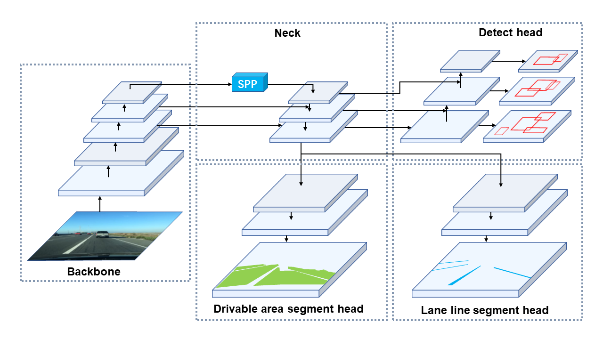
*Figure 1: High-level overview of the YOLOP multi-task network architecture.*

The model consists of one shared encoder (Backbone + Neck) and three task-specific decoder heads:

### 1. Backbone
A **CSPDarknet53** backbone is used for feature extraction. It extracts hierarchical representation maps from the input image at multiple scales. This design supports multi-scale feature generation, enabling the network to identify small vehicles/lanes far away and large obstacles nearby.

### 2. Neck (SPP)
Features from the backbone are passed through a **Spatial Pyramid Pooling (SPP)** module. The SPP layer aggregates context information across multiple receptive field scales (using pooling kernels of size $5 \times 5$, $9 \times 9$, and $13 \times 13$). This step fuses global and local features, improving robustness against scale variations.

### 3. Detection Head
Based on an anchor-based multi-scale detection design similar to YOLOv4. It extracts bounding boxes, class labels (vehicle, pedestrian, etc.), and confidence scores across different feature resolutions.

### 4. Drivable Area Segmentation Head
Utilizes a semantic segmentation branch to perform pixel-level classification. It identifies the exact boundary of the road surface to locate the safe driving region.

### 5. Lane Line Segmentation Head
Processes the features using a dedicated segmentation branch to extract precise lane coordinates. It performs boundary detection to support lane-keeping and route planning.

---

## 🛠️ Computer Vision Enhancements

Our pipeline implements pre-inference CV enhancements inside `tools/demo.py`:
```python
# Night visibility & shadow preprocessing
img_det = cv2.convertScaleAbs(img_det, alpha=1.5, beta=30)
```
* **Contrast Scaling ($\alpha = 1.5$)**: Enhances edge transitions, making faded lane lines stand out from the road surface.
* **Brightness Adjustment ($\beta = 30$)**: Restores pixel intensities in poorly lit frames (e.g. night footage), ensuring that the features are prominent enough for Backbone activation.

### 🔬 Lane Extraction Preprocessing Comparison (HSV vs. RGB-Difference)

To extract lanes robustly under challenging Indian roads and night conditions, the post-processing and evaluation pipeline uses a hybrid method comparing HSV color-space thresholding against an RGB channel difference check:

1. **HSV-Based Masking**: Captures red hue ranges but can be sensitive to dynamic lighting variations and headlight reflections.
2. **RGB-Difference Masking**: Checks red dominance: $(R > 100) \land (R - G > 40) \land (R - B > 40)$. This is highly stable against night shadows and glare.

Below is a comparison showcasing the input frame, HSV mask, and RGB-difference mask results during simulation debugging:

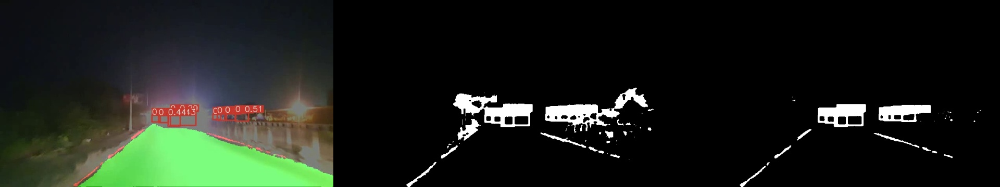
*Figure: Pre-processing lane detection comparison showing original frame (left), HSV mask (center), and RGB-difference mask (right).*

---

## 📊 Results

The model's predictions are saved as localized mask overlays, demonstrating high robustness across diverse road conditions.

### Lane Detection Results
The system extracts lane markings and overlays them in red. 

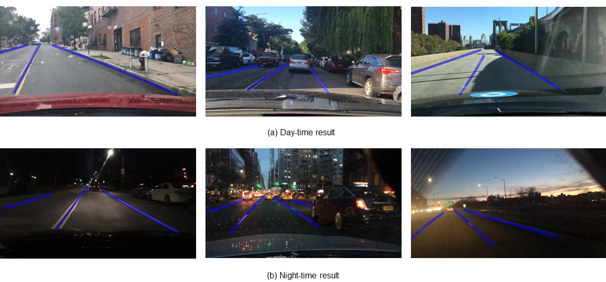
*Figure 2: Ground-truth/prediction visualization of lane extraction under dynamic conditions.*

### Drivable Area Segmentation Results
The drivable road surface is identified in green, outlining the boundary of safe navigation.

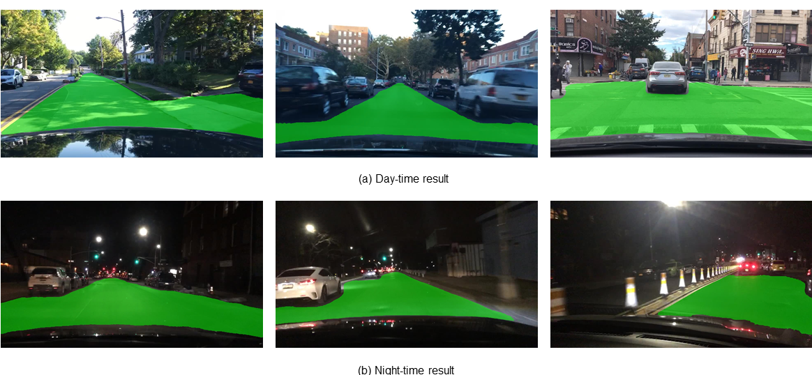
*Figure 3: Semantic classification of the drivable road boundary.*

### Object Detection Results
Obstacles, vehicles, and traffic targets are bounded by bounding boxes with confidence scores.

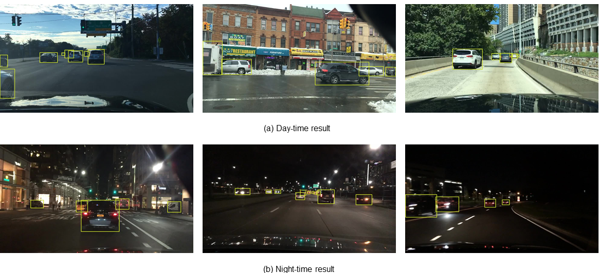
*Figure 4: Bounding boxes generated for object classes.*

### ONNX Runtime Export Results
The repository contains support for exporting the model to ONNX. Visualizations demonstrate fast, high-quality inference:

| Drivable Area ONNX | Lane Line ONNX | Complete Output ONNX |
| :---: | :---: | :---: |
| 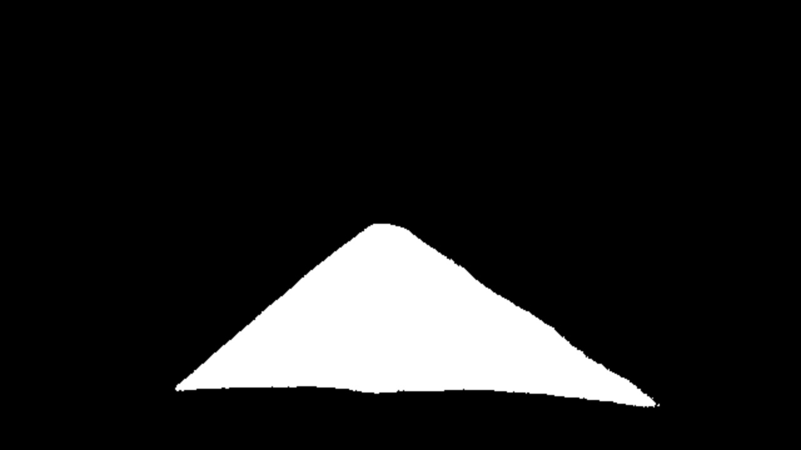 | 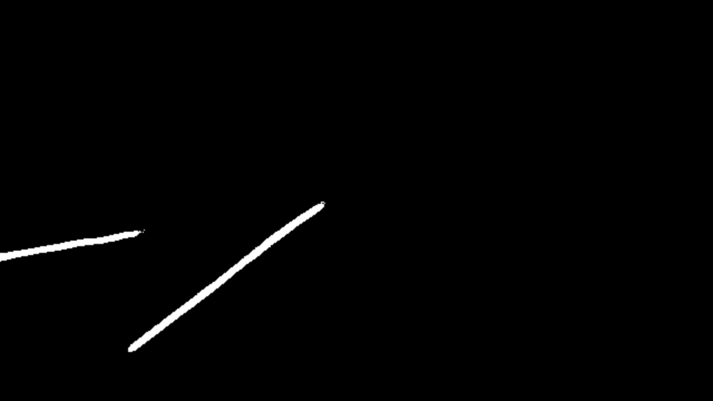 | 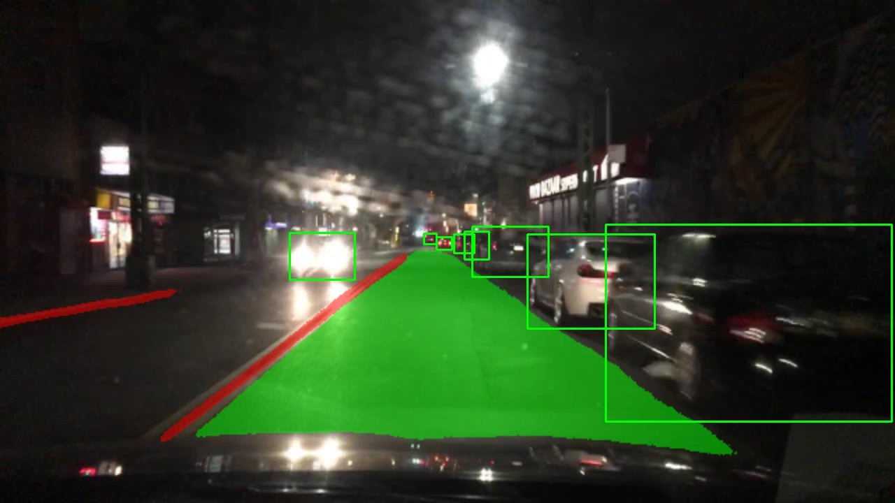 |

### Demonstration Clips
Below are real-time simulation runs on test videos:

| Scenario 1 (Input vs Output) | Scenario 2 (Input vs Output) |
| :---: | :---: |
| 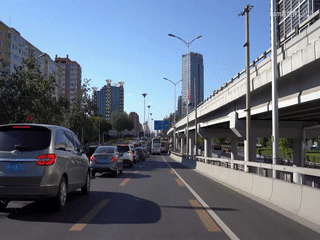 <br> ⬇ <br> 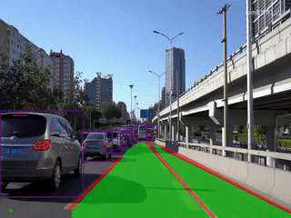 | 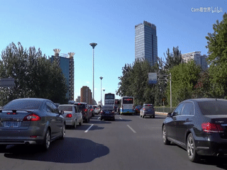 <br> ⬇ <br> 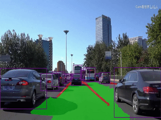 |

---

## 📈 Evaluation

Performance metrics are captured dynamically by `evaluate_lane_video.py` and saved inside `eval_out/run_eval_final/`.

### 1. Detection Ratio Analysis
Measures the proportion of pixels classified as lane markings or road targets relative to total frame resolution.


*Figure 5: Lane detection ratio tracking across the video sequence.*

### 2. Temporal Consistency Evaluation
Measures the consistency of lane detections over consecutive frames. High temporal IoU indicates a stable prediction pipeline that does not flicker.


*Figure 6: Temporal Intersection-over-Union (IoU) profile between consecutive frames.*

### Key Performance Metrics (Aggregate)
Running the evaluation pipeline on the simulation video yields the following overall performance summary:

| Metric | Measured Value | Description |
| :--- | :--- | :--- |
| **Total Processed Frames** | 6,188 frames | Entire duration of simulation |
| **Video FPS** | 30.002 | Target execution rate |
| **Avg. Predicted Lane Pixels** | 49,490.66 | Average density of lane activations per frame |
| **Median Detection Ratio** | 0.5064 | Midpoint of spatial target occupancy |

### Generated Files and Logs
All outputs are stored in `eval_out/run_eval_final/`:
* `per_frame_metrics.csv`: Tabular logging of frame index, pred_pixels, temporal_iou, temporal_ssim, and detection_ratio.
* `summary_metrics.json`: Aggregated simulation metadata.
* `summary_table.csv`: Condensed summary for easy programmatic loading.

---

## 💻 Technology Stack

| Library / Tool | Version | Purpose |
| :--- | :--- | :--- |
| **Python** | `3.8.x` | Base programming environment |
| **PyTorch** | `>= 1.7.0` | Deep learning framework & model loading |
| **OpenCV** | `>= 4.1.2` | Frame processing, color conversions, video I/O |
| **YOLOP** | `v1.0` | Panoptic perception core model |
| **NumPy** | `>= 1.18.5` | Multi-dimensional array operations & metrics |
| **Matplotlib** | `>= 3.2.2` | Generation of evaluation curves and plots |
| **Scikit-Image** | `>= 0.17.2` | Advanced morph cleaning, SSIM computations |

---

## 📂 Project Structure

```bash
YOLOP/
│
├── eval_out/                         # Output folder for metrics and plots
│   └── run_eval_final/               # Evaluation results of the final run
│       ├── detection_ratio.png       # Detection ratio curve
│       ├── temporal_iou.png          # Consecutive-frame IoU curve
│       ├── per_frame_metrics.csv     # Step-by-step frame parameters
│       ├── summary_table.csv         # Metric summary table
│       └── summary_metrics.json      # JSON metadata overview
│
├── inference/                        # Directory for demo inputs and outputs
│   ├── images/                       # Sample images for testing
│   ├── videos/                       # Test video clips (1.mp4)
│   └── output/                       # Output masks and visualizations
│
├── lib/                              # Core library source code
│   ├── config/                       # Network and training configurations
│   ├── core/                         # Loss, evaluation, and postprocessing scripts
│   ├── dataset/                      # BDD100K and AutoDrive custom loaders
│   ├── models/                       # YOLOP PyTorch architecture definition
│   └── utils/                        # Data augmentations, loggers, anchors
│
├── pictures/                         # System diagrams and result assets
│   ├── yolop.png                     # Model architecture diagram
│   ├── da.png / ll.png / detect.png  # Base task visualization images
│   ├── input1.gif / output1.gif      # Demonstration clips
│   └── *_onnx.jpg                    # Exported ONNX model visualization tests
│
├── tools/                            # Execution scripts
│   ├── demo.py                       # CLI inference demo wrapper (Images/Videos/Webcam)
│   ├── test.py                       # Testing and validating scripts
│   └── train.py                      # Multi-task training code
│
├── toolkits/                         # Deployment packages
│   └── deploy/                       # TensorRT C++ and wts export utilities
│
├── requirements.txt                  # List of Python dependencies
├── LICENSE                           # Project license file
├── evaluate_lane_video.py            # Custom video evaluation script
└── export_onnx.py                    # ONNX conversion utility
```

---

## ⚙️ Installation

### Prerequisites
To replicate this project on a Windows OS environment, we recommend setting up a virtual environment or Conda environment with **Python 3.8**.

1. **Python 3.8.10**: [Download Python 3.8.10 (amd64 Windows Installer)](https://www.python.org/downloads/release/python-3810/)
2. **CUDA Toolkit**:
   * For PyTorch 1.7.0/1.7.1, we recommend **CUDA 10.2**: [CUDA Toolkit 10.2 Archive](https://developer.nvidia.com/cuda-10.2-download-archive)
   * For newer graphics cards (Ampere/Ada Lovelace), use **CUDA 11.0**: [CUDA Toolkit 11.0 Archive](https://developer.nvidia.com/cuda-11.0-download-archive)
3. **cuDNN**: [NVIDIA cuDNN Archive](https://developer.nvidia.com/rdp/cudnn-archive) (select the version matching your CUDA selection)

### Step-by-Step Installation
1. Clone this repository:
   ```bash
   git clone https://github.com/nova2824/Lane-Detection-for-Indian-Roads-using-YOLOP.git
   cd Lane-Detection-for-Indian-Roads-using-YOLOP
   ```

2. Install PyTorch with your selected CUDA toolkit version. Refer to the [PyTorch Previous Versions Page](https://pytorch.org/get-started/previous-versions/#v170):
   ```bash
   # For CUDA 10.2
   pip install torch==1.7.0+cu102 torchvision==0.8.1+cu102 -f https://download.pytorch.org/whl/torch_stable.html

   # For CUDA 11.0
   pip install torch==1.7.0+cu110 torchvision==0.8.1+cu110 -f https://download.pytorch.org/whl/torch_stable.html
   ```

3. Install the remaining dependencies listed in `requirements.txt`:
   ```bash
   pip install -r requirements.txt
   ```

4. Download the pretrained weights and place them inside the `weights/` directory:
   * [End-to-end.pth Weight Link](https://drive.google.com/file/d/1Ge-R8NTxG1eqd4zbryFo-1Uonuh0Nxyl/view?usp=sharing) (default YOLOP weights file).

---

## 🚀 Running Inference

To run the panoptic perception inference pipeline on your own video file:

```bash
# Save output to standard directory
python tools/demo.py --source inference/videos/1.mp4 --weights weights/End-to-end.pth --save-dir inference/output

# Run on a camera feed
python tools/demo.py --source 0 --weights weights/End-to-end.pth
```

---

## 📊 Running Evaluation

To evaluate your generated prediction video and compile statistical graphs (temporal IoU, detection ratio, summary table):

```powershell
# Set path for final evaluation run
$eval_out = Join-Path $PWD "eval_out\run_eval_final"

# Run evaluation script (extract masks using color method and downsample for speed)
python evaluate_lane_video.py `
  --pred_video "inference/output/1.mp4" `
  --out_dir $eval_out `
  --color_method color `
  --downsample 2
```

---

## 🔮 Future Improvements

* **Edge Device Target Compilation**: Port the TensorRT engine to run directly on embedded hardware (NVIDIA Jetson Nano or Xavier NX) for real-world vehicular testing.
* **Weather-Aware Preprocessing**: Add adaptive histogram equalization (such as CLAHE) and defogging algorithms to handle rainy or foggy weather conditions.
* **Advanced Tracking Layers**: Implement a Kalman Filter or LSTM-based tracking head to smooth lane predictions when markings are completely missing.
* **MLOps Integration**: Automate the pipeline using cloud logging tools to track model drift and frame failures dynamically.

---

## 👤 Author

* **Narayanrao Kulkarni**
* Final-Year Computer Science (AI & ML)
* KLS VDIT (KLS Vishwanathrao Deshpande Institute of Technology)
